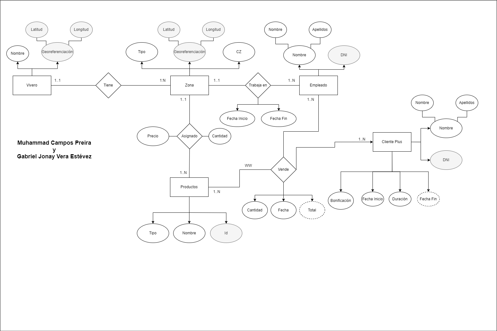
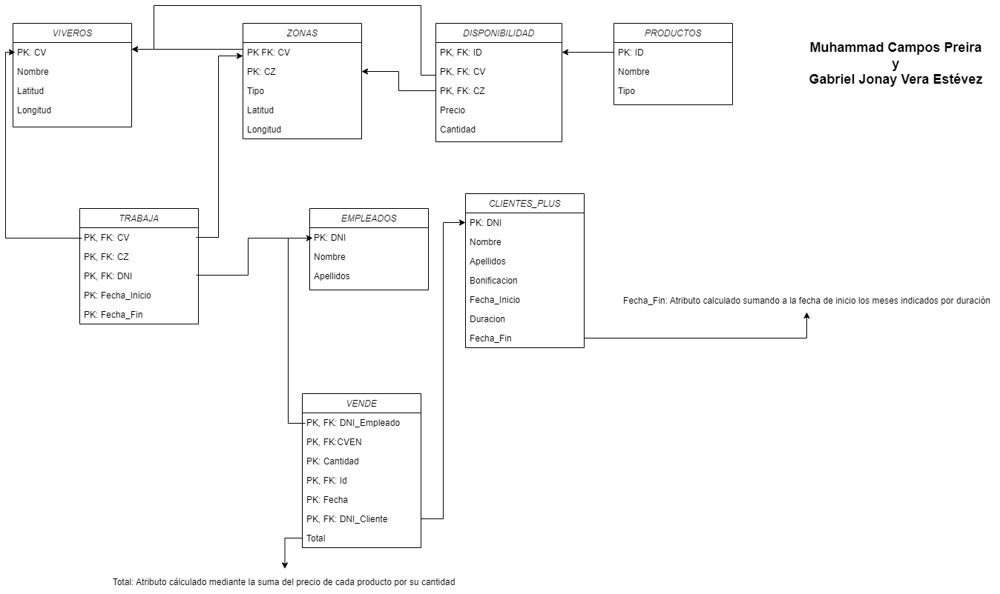

# Modelo-relacional.-Viveros

## Script de creación de tablas

[Script de creación de tablas](viveros.sql)

## Modelo entidad-relación



## Modelo relacional



## SELECT * DE LAS TABLAS

### Entrada

```sql
SELECT * FROM viveros;
SELECT * FROM zonas;
SELECT * FROM productos;
SELECT * FROM disponibilidad;
SELECT * FROM empleados;
SELECT * FROM trabaja;
SELECT * FROM clientes_plus;
SELECT * FROM vende;
```

### Salida

```sql
 cv |  nombre  | latitud | longitud 
----+----------+---------+----------
  1 | Vivero 1 |       0 |        0
  2 | Vivero 2 |      10 |       10
  3 | Vivero 3 |      20 |       20
  4 | Vivero 4 |      30 |       30
  5 | Vivero 5 |      40 |       40
(5 rows)

 cv | cz |  tipo   | latitud | longitud 
----+----+---------+---------+----------
  1 |  1 | Almacen |       5 |        5
  2 |  1 | Almacen |      15 |       15
  3 |  1 | Almacen |      25 |       25
  4 |  1 | Almacen |      35 |       35
  5 |  1 | Almacen |      45 |       45
(5 rows)

 id |   nombre   |  tipo  
----+------------+--------
  1 | Producto 1 | Tipo 1
  2 | Producto 2 | Tipo 2
  3 | Producto 3 | Tipo 3
  4 | Producto 4 | Tipo 4
  5 | Producto 5 | Tipo 5
(5 rows)

 cv | cz | id | precio | cantidad 
----+----+----+--------+----------
  2 |  1 |  2 |      5 |       14
  2 |  1 |  3 |     15 |       27
  2 |  1 |  4 |     20 |       26
  2 |  1 |  5 |     25 |       43
  2 |  1 |  1 |     10 |        3
(5 rows)

    dni    |   nombre   |  apellidos  
-----------+------------+-------------
 12345678A | Empleado 1 | Apellidos 1
 12345678B | Empleado 2 | Apellidos 2
 12345678C | Empleado 3 | Apellidos 3
 12345678D | Empleado 4 | Apellidos 4
 12345678X | Empleado 5 | Apellidos 5
(5 rows)

    dni    | cv | cz | fecha_inicio | fecha_fin  
-----------+----+----+--------------+------------
 12345678A |  2 |  1 | 2019-01-01   | 2019-01-02
 12345678A |  1 |  1 | 2019-01-03   | 2019-01-03
 12345678C |  2 |  1 | 2019-01-01   | 2019-01-02
 12345678D |  2 |  1 | 2019-01-01   | 2019-01-02
 12345678B |  2 |  1 | 2019-01-01   | 2019-01-02
(5 rows)

    dni    |  nombre   |  apellidos  | fecha_inicio | fecha_fin  | duracion | bonificacion 
-----------+-----------+-------------+--------------+------------+----------+--------------
 12345678E | Cliente 5 | Apellidos 5 | 2019-01-01   | 2019-03-01 |        2 |            0
 12345678D | Cliente 4 | Apellidos 4 | 2019-01-01   | 2019-02-01 |        1 |         0.04
 12345678C | Cliente 3 | Apellidos 3 | 2019-01-01   | 2019-07-01 |        6 |         0.04
 12345678B | Cliente 2 | Apellidos 2 | 2019-01-01   | 2019-06-01 |        5 |         0.04
 12345678A | Cliente 1 | Apellidos 1 | 2019-01-01   | 2019-04-01 |        3 |         0.08
(5 rows)

 cve |    dni    |           fecha            |  ids  | cantidades | dni_cliente |  total   
-----+-----------+----------------------------+-------+------------+-------------+----------
   1 | 12345678A | 2023-10-31 20:34:03.812366 | {1,2} | {5,1}      | 12345678A   |       55
   2 | 12345678B | 2023-10-31 20:34:03.8157   | {2,3} | {5,1}      | 12345678D   |       40
   3 | 12345678C | 2023-10-31 20:34:03.817444 | {3,4} | {2,9}      | 12345678C   |      210
   4 | 12345678D | 2023-10-31 20:34:03.819673 | {4,5} | {5,3}      | 12345678B   |      175
   5 | 12345678A | 2023-10-31 20:34:03.821046 | {5,1} | {4,2}      | 12345678A   | 111.3600
(5 rows)
```

## CASOS ESPECIALES TRATADOS CON TRIGGERS

### Código de Zona autocálculado

```sql
INSERT INTO zonas (cv, tipo, latitud, longitud) VALUES (1, 'Almacen', 5, 5);
SELECT * FROM zonas;
```

```sql
 cv | cz |  tipo   | latitud | longitud 
----+----+---------+---------+----------
  1 |  1 | Almacen |       5 |        5
  2 |  1 | Almacen |      15 |       15
  3 |  1 | Almacen |      25 |       25
  4 |  1 | Almacen |      35 |       35
  5 |  1 | Almacen |      45 |       45
(5 rows)
```

### Cantidad de productos en disponibilidad disminuye al vender y nunca es menor que 0

```sql
SELECT * FROM disponibilidad;
INSERT INTO vende (dni, ids, cantidades, dni_cliente) VALUES ('12345678A', '{2}', '{14}', '12345678A');
SELECT * FROM disponibilidad;
INSERT INTO vende (dni, ids, cantidades, dni_cliente) VALUES ('12345678A', '{3}', '{28}', '12345678A');
```
```sql
 cv | cz | id | precio | cantidad 
----+----+----+--------+----------
  2 |  1 |  2 |      5 |       14
  2 |  1 |  3 |     15 |       27
  2 |  1 |  4 |     20 |       26
  2 |  1 |  5 |     25 |       43
  2 |  1 |  1 |     10 |        3
(5 rows)

viveros=# INSERT INTO vende (dni, ids, cantidades, dni_cliente) VALUES ('12345678A', '{2}', '{14}', '12345678A');
INSERT 0 1
viveros=# SELECT * FROM disponibilidad;
 cv | cz | id | precio | cantidad 
----+----+----+--------+----------
  2 |  1 |  3 |     15 |       27
  2 |  1 |  4 |     20 |       26
  2 |  1 |  5 |     25 |       43
  2 |  1 |  1 |     10 |        3
  2 |  1 |  2 |      5 |        0
(5 rows)

viveros=# INSERT INTO vende (dni, ids, cantidades, dni_cliente) VALUES ('12345678A', '{3}', '{28}', '12345678A');
ERROR:  No hay suficiente cantidad del producto 3
CONTEXT:  PL/pgSQL function actualizar_cantidad_disponibilidad() line 11 at RAISE
```


### El empleado no puede trabajar en dos viveros a la vez

```sql
INSERT INTO trabaja (dni, cv, cz, fecha_inicio, fecha_fin) VALUES ('12345678A', 2, 1, '2020-01-01', '2020-10-02');
INSERT INTO trabaja (dni, cv, cz, fecha_inicio, fecha_fin) VALUES ('12345678A', 2, 1, '2020-05-01', '2020-12-02');
```

```sql
viveros=# INSERT INTO trabaja (dni, cv, cz, fecha_inicio, fecha_fin) VALUES ('12345678A', 2, 1, '2020-01-01', '2020-10-02');
INSERT 0 1
viveros=# INSERT INTO trabaja (dni, cv, cz, fecha_inicio, fecha_fin) VALUES ('12345678A', 2, 1, '2020-05-01', '2020-12-02');
ERROR:  Ya existe un trabajo para el mismo DNI con un período que se superpone.
CONTEXT:  PL/pgSQL function comprobar_trabajo_existente() line 9 at RAISE
```

### Cada cliente tiene un descuento asociado que aumenta con cada compra

```sql
SELECT * FROM clientes_plus;
INSERT INTO vende (dni, ids, cantidades, dni_cliente) VALUES ('12345678A', '{3, 2}', '{5, 1}', '12345678A');
SELECT * FROM clientes_plus;
```
    
```sql
viveros2=# SELECT * FROM clientes_plus;
    dni    |  nombre   |  apellidos  | fecha_inicio | fecha_fin  | duracion | bonificacion 
-----------+-----------+-------------+--------------+------------+----------+--------------
 12345678E | Cliente 5 | Apellidos 5 | 2019-01-01   | 2019-03-01 |        2 |            0
 12345678D | Cliente 4 | Apellidos 4 | 2019-01-01   | 2019-02-01 |        1 |         0.04
 12345678C | Cliente 3 | Apellidos 3 | 2019-01-01   | 2019-07-01 |        6 |         0.04
 12345678A | Cliente 1 | Apellidos 1 | 2019-01-01   | 2019-04-01 |        3 |         0.08
 12345678B | Cliente 2 | Apellidos 2 | 2019-01-01   | 2019-06-01 |        5 |         0.08
(5 rows)

viveros2=# INSERT INTO vende (dni, ids, cantidades, dni_cliente) VALUES ('12345678A', '{3, 2}', '{5, 1}', '12345678A');
INSERT 0 1
viveros2=# SELECT * FROM clientes_plus;
    dni    |  nombre   |  apellidos  | fecha_inicio | fecha_fin  | duracion | bonificacion 
-----------+-----------+-------------+--------------+------------+----------+--------------
 12345678E | Cliente 5 | Apellidos 5 | 2019-01-01   | 2019-03-01 |        2 |            0
 12345678D | Cliente 4 | Apellidos 4 | 2019-01-01   | 2019-02-01 |        1 |         0.04
 12345678C | Cliente 3 | Apellidos 3 | 2019-01-01   | 2019-07-01 |        6 |         0.04
 12345678B | Cliente 2 | Apellidos 2 | 2019-01-01   | 2019-06-01 |        5 |         0.08
 12345678A | Cliente 1 | Apellidos 1 | 2019-01-01   | 2019-04-01 |        3 |         0.12
(5 rows)
```

### Fecha final de cliente_plus se calcula automáticamente mediante la duración

```sql
INSERT INTO clientes_plus (dni, nombre, apellidos, fecha_inicio, duracion) VALUES ('12345678Y', 'Cliente 1', 'Apellidos 1', '2019-01-01', 6);
SELECT * FROM clientes_plus;
```

```sql
viveros2=# INSERT INTO clientes_plus (dni, nombre, apellidos, fecha_inicio, duracion) VALUES ('12345678Y', 'Cliente 6', 'Apellidos 6', '2019-01-01', 6);
INSERT 0 1
viveros2=# SELECT * FROM clientes_plus;
    dni    |  nombre   |  apellidos  | fecha_inicio | fecha_fin  | duracion | bonificacion 
-----------+-----------+-------------+--------------+------------+----------+--------------
 12345678Y | Cliente 6 | Apellidos 6 | 2019-01-01   | 2019-07-01 |        6 |            0
 12345678E | Cliente 5 | Apellidos 5 | 2019-01-01   | 2019-03-01 |        2 |            0
 12345678D | Cliente 4 | Apellidos 4 | 2019-01-01   | 2019-02-01 |        1 |         0.04
 12345678C | Cliente 3 | Apellidos 3 | 2019-01-01   | 2019-07-01 |        6 |         0.04
 12345678B | Cliente 2 | Apellidos 2 | 2019-01-01   | 2019-06-01 |        5 |         0.08
 12345678A | Cliente 1 | Apellidos 1 | 2019-01-01   | 2019-04-01 |        3 |         0.12
(6 rows)
```

### Todos los id de productos en vende deben existir en disponibilidad

```sql
SELECT * FROM vende;
INSERT INTO vende (dni, ids, cantidades, dni_cliente) VALUES ('12345678A', '{20}', '{2}', '12345678A');
```

```sql
viveros=# SELECT * FROM vende;
 cve |    dni    |           fecha            |  ids  | cantidades | dni_cliente |  total   
-----+-----------+----------------------------+-------+------------+-------------+----------
   1 | 12345678A | 2023-10-31 20:34:03.812366 | {1,2} | {5,1}      | 12345678A   |       55
   2 | 12345678B | 2023-10-31 20:34:03.8157   | {2,3} | {5,1}      | 12345678D   |       40
   3 | 12345678C | 2023-10-31 20:34:03.817444 | {3,4} | {2,9}      | 12345678C   |      210
   4 | 12345678D | 2023-10-31 20:34:03.819673 | {4,5} | {5,3}      | 12345678B   |      175
   5 | 12345678A | 2023-10-31 20:34:03.821046 | {5,1} | {4,2}      | 12345678A   | 111.3600
   7 | 12345678A | 2023-10-31 20:37:13.975066 | {4}   | {2}        | 12345678A   |    36.80
(6 rows)

viveros=# INSERT INTO vende (dni, ids, cantidades, dni_cliente) VALUES ('12345678A', '{20}', '{2}', '12345678A');
ERROR:  El producto 20 no existe.
CONTEXT:  PL/pgSQL function comprobar_id_existente() line 10 at RAISE
```

### El total de la venta se calcula automáticamente

```sql
SELECT * FROM vende;
INSERT INTO vende (dni, ids, cantidades, dni_cliente) VALUES ('12345678A', '{4}', '{2}', '12345678A');
SELECT * FROM vende;
```

```sql
viveros=# SELECT * FROM vende;
 cve |    dni    |           fecha            |  ids  | cantidades | dni_cliente |  total   
-----+-----------+----------------------------+-------+------------+-------------+----------
   1 | 12345678A | 2023-10-31 20:34:03.812366 | {1,2} | {5,1}      | 12345678A   |       55
   2 | 12345678B | 2023-10-31 20:34:03.8157   | {2,3} | {5,1}      | 12345678D   |       40
   3 | 12345678C | 2023-10-31 20:34:03.817444 | {3,4} | {2,9}      | 12345678C   |      210
   4 | 12345678D | 2023-10-31 20:34:03.819673 | {4,5} | {5,3}      | 12345678B   |      175
   5 | 12345678A | 2023-10-31 20:34:03.821046 | {5,1} | {4,2}      | 12345678A   | 111.3600
(5 rows)

viveros=# INSERT INTO vende (dni, ids, cantidades, dni_cliente) VALUES ('12345678A', '{4}', '{2}', '12345678A');
INSERT 0 1

viveros=# SELECT * FROM vende;
 cve |    dni    |           fecha            |  ids  | cantidades | dni_cliente |  total   
-----+-----------+----------------------------+-------+------------+-------------+----------
   1 | 12345678A | 2023-10-31 20:34:03.812366 | {1,2} | {5,1}      | 12345678A   |       55
   2 | 12345678B | 2023-10-31 20:34:03.8157   | {2,3} | {5,1}      | 12345678D   |       40
   3 | 12345678C | 2023-10-31 20:34:03.817444 | {3,4} | {2,9}      | 12345678C   |      210
   4 | 12345678D | 2023-10-31 20:34:03.819673 | {4,5} | {5,3}      | 12345678B   |      175
   5 | 12345678A | 2023-10-31 20:34:03.821046 | {5,1} | {4,2}      | 12345678A   | 111.3600
   6 | 12345678A | 2023-10-31 20:37:13.975066 | {4}   | {2}        | 12345678A   |    36.80
(6 rows)
```
